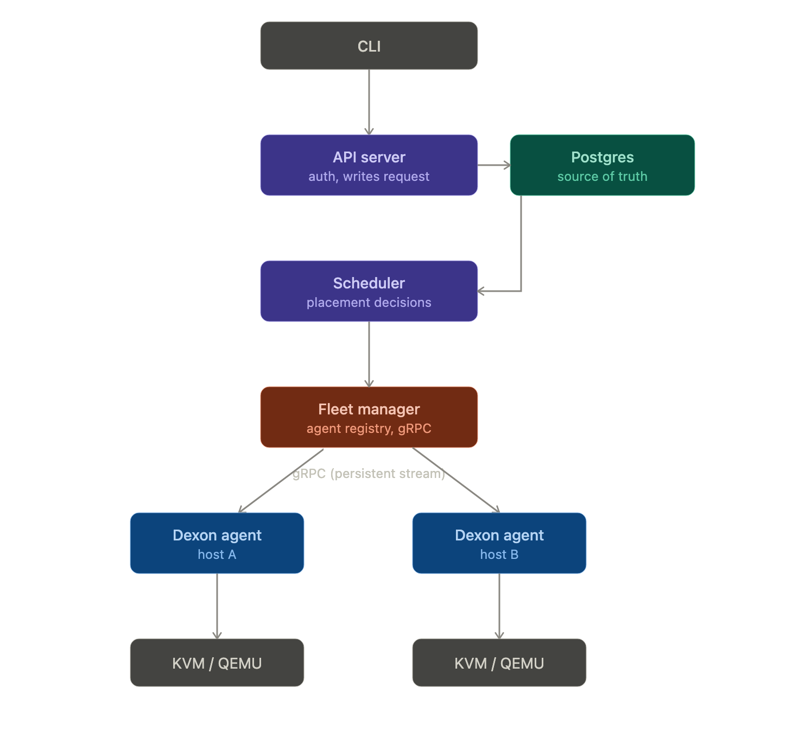
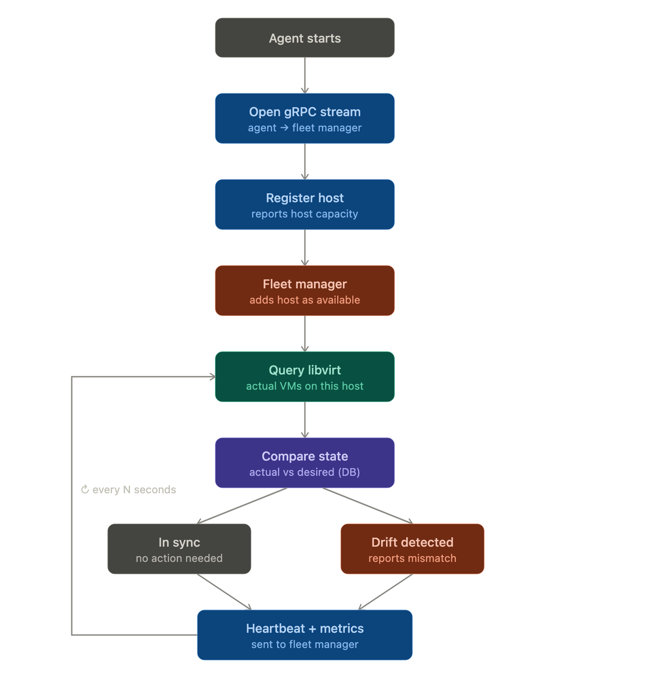

# dumy arch
This doc will hold initial design designs. thought proces and architecture going forward. This will be ever changing and fast paced.

## components and architecture

cli for users -> API -> server running Dexon on Control plane (Authenticaion&Authorization connected to DB save the request) -> scheduler (connected to DB will pickup request)-> grpc()-> Dexon agent running on each node (running hypervisor) will create/destroy VMs

### connections between Dexon scheduler and agent

Dexon scheduler <-> Dexon agent
- ping from agent to scheduler for alive status           once
- metric from agent to scheduler for monitoring of vm     stream
- create/destroy vm from scheduler to agent               once

#### Dexon overall Architecture

#### Dexon Agent registration and reconciliation

"The agent never writes. It only observes, reports, and executes commands it's given."

early grpc structure [dexon_agent.proto](dexon_agent.proto)
